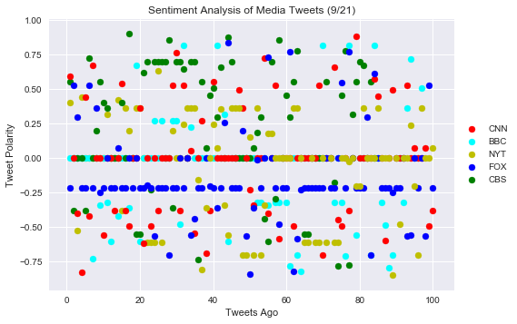
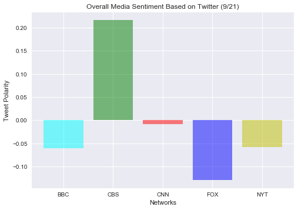

# TWITTER SENTIMENTS
## OBSERVATIONS

- Fox News is has the lowest sentiment score out of all news networks indicating that tweets posted to their page carry negative sentiment more often than that of other news networks. 
- CBS on the other hand has the highest sentiment scores indicating that tweets posted to their page usually carry more positive sentiments.
- Most tweets tended to be neutral in nature with compound scores of zero so there are many instances in which posted tweets do not have any impact on the sentiment rating of the network.


```python
import matplotlib.pyplot as plt
import requests as req
import pandas as pd
import tweepy
import json
import seaborn as sns
import matplotlib.patches as mpatches
import numpy as np
from vaderSentiment.vaderSentiment import SentimentIntensityAnalyzer
analyzer = SentimentIntensityAnalyzer()
```


```python
# Twitter API Credentials
consumer_key = "hOmtTSlsgccHdUT0tuec2pusM"
consumer_secret = "B7UUkNqKaAFjyKA1tSWCbxG4bVm1J7N2osBT4uSoEk4gN4GYVC"
access_token = "869703899963371520-2pt0OjB9KnDqyIe9BgMwQtBLj5ShosD"
access_token_secret = "LnIycvYf7HSbT20Eo4i8YmxXS6vPO6UfaD3pLyd6O0Die"
```


```python
# Use Tweepy to Authenticate our access
auth = tweepy.OAuthHandler(consumer_key, consumer_secret)
auth.set_access_token(access_token, access_token_secret)
api = tweepy.API(auth, parser=tweepy.parsers.JSONParser())
```


```python
news_networks = ["@CNN","@FoxNews","@BBC","@NYT","@CBS"]
```


```python
news = []
account =[]
date = []
text =[]
tweet_number=[]
compound_list = []
positive_list = []
negative_list = []
neutral_list = []
for network in news_networks:
    public_tweets = api.search(network, count=100, result_type="recent")
    for tweet in public_tweets['statuses']:
        compound = analyzer.polarity_scores(tweet["text"])["compound"]
        pos = analyzer.polarity_scores(tweet["text"])["pos"]
        neu = analyzer.polarity_scores(tweet["text"])["neu"]
        neg = analyzer.polarity_scores(tweet["text"])["neg"]
        news.append(network)
        account.append(tweet['user']['name'])
        date.append(tweet['created_at'])
        text.append(tweet['text'])
        compound_list.append(compound)
        positive_list.append(pos)
        negative_list.append(neg)
        neutral_list.append(neu)
```


```python
#create the data frame
df = pd.DataFrame({
    "Network":news,
    "User":account,
    "Date":date,
    "Text":text,
    "Positive":positive_list,
    "Neutral":neutral_list,
    "Negative":negative_list,
    "Compound":compound_list,
})
df = df[['Network','User','Date','Text','Positive','Neutral','Negative','Compound']]
```


    @FoxNews    100
    @NYT        100
    @CNN        100
    @BBC         97
    @CBS         84
    Name: Network, dtype: int64


```python
df.to_csv("Twitter_Sentiments.csv")
df = df.sort_values("Date")
df
```


<div>
<style>
    .dataframe thead tr:only-child th {
        text-align: right;
    }

    .dataframe thead th {
        text-align: left;
    }

    .dataframe tbody tr th {
        vertical-align: top;
    }
</style>
<table border="1" class="dataframe">
  <thead>
    <tr style="text-align: right;">
      <th></th>
      <th>Network</th>
      <th>User</th>
      <th>Date</th>
      <th>Text</th>
      <th>Positive</th>
      <th>Neutral</th>
      <th>Negative</th>
      <th>Compound</th>
    </tr>
  </thead>
  <tbody>
    <tr>
      <th>327</th>
      <td>@NYT</td>
      <td>Joey Baker</td>
      <td>Fri Sep 22 00:06:38 +0000 2017</td>
      <td>This should have been in the opinion section. ...</td>
      <td>0.119</td>
      <td>0.881</td>
      <td>0.000</td>
      <td>0.4019</td>
    </tr>
    <tr>
      <th>326</th>
      <td>@NYT</td>
      <td>Joey Baker</td>
      <td>Fri Sep 22 00:08:24 +0000 2017</td>
      <td>@NYT The quotes from tech companies are pro-fo...</td>
      <td>0.000</td>
      <td>1.000</td>
      <td>0.000</td>
      <td>0.0000</td>
    </tr>
    <tr>
      <th>325</th>
      <td>@NYT</td>
      <td>Doc holiday</td>
      <td>Fri Sep 22 00:28:47 +0000 2017</td>
      <td>@NewtTrump @MSNBC @GeorgiaDirtRoad @nyt @CNN  ...</td>
      <td>0.000</td>
      <td>0.638</td>
      <td>0.362</td>
      <td>-0.5267</td>
    </tr>
    <tr>
      <th>324</th>
      <td>@NYT</td>
      <td>ReefScan</td>
      <td>Fri Sep 22 00:39:13 +0000 2017</td>
      <td>RT @NYT: Building a Better Coral Reef. https:/...</td>
      <td>0.326</td>
      <td>0.674</td>
      <td>0.000</td>
      <td>0.4404</td>
    </tr>
    <tr>
      <th>323</th>
      <td>@NYT</td>
      <td>kmg</td>
      <td>Fri Sep 22 00:51:43 +0000 2017</td>
      <td>RT @NYT: Kim’s Rejoinder to Trump’s Rocket Man...</td>
      <td>0.000</td>
      <td>1.000</td>
      <td>0.000</td>
      <td>0.0000</td>
    </tr>
    <tr>
      <th>322</th>
      <td>@NYT</td>
      <td>YMCA Chicago</td>
      <td>Fri Sep 22 01:00:05 +0000 2017</td>
      <td>Hey parents, what #apps are your kids and teen...</td>
      <td>0.000</td>
      <td>1.000</td>
      <td>0.000</td>
      <td>0.0000</td>
    </tr>
    <tr>
      <th>321</th>
      <td>@NYT</td>
      <td>richard p. mchugh</td>
      <td>Fri Sep 22 01:04:05 +0000 2017</td>
      <td>RT @NYT: Kim’s Rejoinder to Trump’s Rocket Man...</td>
      <td>0.000</td>
      <td>1.000</td>
      <td>0.000</td>
      <td>0.0000</td>
    </tr>
    <tr>
      <th>320</th>
      <td>@NYT</td>
      <td>Zaire</td>
      <td>Fri Sep 22 01:11:44 +0000 2017</td>
      <td>RT @NYT: Kim’s Rejoinder to Trump’s Rocket Man...</td>
      <td>0.000</td>
      <td>1.000</td>
      <td>0.000</td>
      <td>0.0000</td>
    </tr>
    <tr>
      <th>319</th>
      <td>@NYT</td>
      <td>cjland</td>
      <td>Fri Sep 22 01:14:39 +0000 2017</td>
      <td>A Glowing Cotton Study That Might Have Deserve...</td>
      <td>0.000</td>
      <td>1.000</td>
      <td>0.000</td>
      <td>0.0000</td>
    </tr>
    <tr>
      <th>318</th>
      <td>@NYT</td>
      <td>AVST-CX-E</td>
      <td>Fri Sep 22 01:14:43 +0000 2017</td>
      <td>A Glowing Cotton Study That Might Have Deserve...</td>
      <td>0.000</td>
      <td>1.000</td>
      <td>0.000</td>
      <td>0.0000</td>
    </tr>
    <tr>
      <th>317</th>
      <td>@NYT</td>
      <td>ことりん</td>
      <td>Fri Sep 22 01:28:39 +0000 2017</td>
      <td>@BBC　@CNN　@NYT\n【テキサス親父】Comfort Women the trut...</td>
      <td>0.204</td>
      <td>0.796</td>
      <td>0.000</td>
      <td>0.3182</td>
    </tr>
    <tr>
      <th>316</th>
      <td>@NYT</td>
      <td>Antonio Velardo</td>
      <td>Fri Sep 22 01:29:15 +0000 2017</td>
      <td>"Facebook’s Frankenstein Moment" via @NYT http...</td>
      <td>0.000</td>
      <td>1.000</td>
      <td>0.000</td>
      <td>0.0000</td>
    </tr>
    <tr>
      <th>315</th>
      <td>@NYT</td>
      <td>A Y O M I D E</td>
      <td>Fri Sep 22 01:29:38 +0000 2017</td>
      <td>"Facebook’s Frankenstein Moment" by KEVIN ROOS...</td>
      <td>0.000</td>
      <td>1.000</td>
      <td>0.000</td>
      <td>0.0000</td>
    </tr>
    <tr>
      <th>314</th>
      <td>@NYT</td>
      <td>Michael</td>
      <td>Fri Sep 22 01:47:49 +0000 2017</td>
      <td>RT @NYT: Scott Perry, New Knicks G.M., Likes T...</td>
      <td>0.189</td>
      <td>0.811</td>
      <td>0.000</td>
      <td>0.4215</td>
    </tr>
    <tr>
      <th>313</th>
      <td>@NYT</td>
      <td>Bill Barrow</td>
      <td>Fri Sep 22 01:52:20 +0000 2017</td>
      <td>------&amp;gt; RT @NYT: The Home Run Explosion Is ...</td>
      <td>0.000</td>
      <td>0.822</td>
      <td>0.178</td>
      <td>-0.3818</td>
    </tr>
    <tr>
      <th>312</th>
      <td>@NYT</td>
      <td>ことりん</td>
      <td>Fri Sep 22 01:58:25 +0000 2017</td>
      <td>@BBC　@CNN　@NYT　　The Comfort Women Controversy ...</td>
      <td>0.152</td>
      <td>0.848</td>
      <td>0.000</td>
      <td>0.3612</td>
    </tr>
    <tr>
      <th>311</th>
      <td>@NYT</td>
      <td>SquareOne™</td>
      <td>Fri Sep 22 02:11:06 +0000 2017</td>
      <td>Writing Rupert, Playing Murdoch, Making ‘Ink’ ...</td>
      <td>0.184</td>
      <td>0.816</td>
      <td>0.000</td>
      <td>0.2023</td>
    </tr>
    <tr>
      <th>310</th>
      <td>@NYT</td>
      <td>SquareOne™</td>
      <td>Fri Sep 22 02:11:09 +0000 2017</td>
      <td>Latest Obamacare Repeal Effort Is Most Far-Rea...</td>
      <td>0.000</td>
      <td>1.000</td>
      <td>0.000</td>
      <td>0.0000</td>
    </tr>
    <tr>
      <th>309</th>
      <td>@NYT</td>
      <td>SquareOne™</td>
      <td>Fri Sep 22 02:11:11 +0000 2017</td>
      <td>Megyn Kelly Is Ready for Her Morning Closeup h...</td>
      <td>0.200</td>
      <td>0.800</td>
      <td>0.000</td>
      <td>0.3612</td>
    </tr>
    <tr>
      <th>308</th>
      <td>@NYT</td>
      <td>Jose Tijam, PMP, CSM</td>
      <td>Fri Sep 22 02:15:54 +0000 2017</td>
      <td>"Megyn Kelly Is Ready for Her Morning Closeup"...</td>
      <td>0.128</td>
      <td>0.872</td>
      <td>0.000</td>
      <td>0.3612</td>
    </tr>
    <tr>
      <th>307</th>
      <td>@NYT</td>
      <td>JuanPonsMoyano🌈🌈🌈</td>
      <td>Fri Sep 22 02:25:33 +0000 2017</td>
      <td>@40Andaya @nytimes @thetimes @elpais_espana @L...</td>
      <td>0.000</td>
      <td>1.000</td>
      <td>0.000</td>
      <td>0.0000</td>
    </tr>
    <tr>
      <th>306</th>
      <td>@NYT</td>
      <td>Rhonda Hurley</td>
      <td>Fri Sep 22 03:07:21 +0000 2017</td>
      <td>RT @disings: .@CNN @MSNBC @NBC @ABC @washingto...</td>
      <td>0.000</td>
      <td>0.784</td>
      <td>0.216</td>
      <td>-0.6070</td>
    </tr>
    <tr>
      <th>305</th>
      <td>@NYT</td>
      <td>Vicki Jay</td>
      <td>Fri Sep 22 03:08:40 +0000 2017</td>
      <td>RT @disings: .@CNN @MSNBC @NBC @ABC @washingto...</td>
      <td>0.000</td>
      <td>0.784</td>
      <td>0.216</td>
      <td>-0.6070</td>
    </tr>
    <tr>
      <th>304</th>
      <td>@NYT</td>
      <td>bryan hamm</td>
      <td>Fri Sep 22 03:11:23 +0000 2017</td>
      <td>RT @disings: .@CNN @MSNBC @NBC @ABC @washingto...</td>
      <td>0.000</td>
      <td>0.784</td>
      <td>0.216</td>
      <td>-0.6070</td>
    </tr>
    <tr>
      <th>303</th>
      <td>@NYT</td>
      <td>bryan hamm</td>
      <td>Fri Sep 22 03:12:22 +0000 2017</td>
      <td>@disings @CNN @MSNBC @nbc @ABC @washingtonpost...</td>
      <td>0.259</td>
      <td>0.741</td>
      <td>0.000</td>
      <td>0.6369</td>
    </tr>
    <tr>
      <th>302</th>
      <td>@NYT</td>
      <td>MS.⭐ MAC❤AMERICA👠</td>
      <td>Fri Sep 22 03:16:36 +0000 2017</td>
      <td>RT @disings: .@CNN @MSNBC @NBC @ABC @washingto...</td>
      <td>0.000</td>
      <td>0.784</td>
      <td>0.216</td>
      <td>-0.6070</td>
    </tr>
    <tr>
      <th>301</th>
      <td>@NYT</td>
      <td>Citizen1452</td>
      <td>Fri Sep 22 03:27:48 +0000 2017</td>
      <td>Kim 2 Trump’s Rocket Man: Mentally Deranged US...</td>
      <td>0.000</td>
      <td>1.000</td>
      <td>0.000</td>
      <td>0.0000</td>
    </tr>
    <tr>
      <th>300</th>
      <td>@NYT</td>
      <td>Quacker</td>
      <td>Fri Sep 22 03:38:01 +0000 2017</td>
      <td>@JoyceWhiteVance @maddow @NYT dolt they didn't...</td>
      <td>0.000</td>
      <td>1.000</td>
      <td>0.000</td>
      <td>0.0000</td>
    </tr>
    <tr>
      <th>299</th>
      <td>@NYT</td>
      <td>cherskoubo</td>
      <td>Fri Sep 22 03:47:14 +0000 2017</td>
      <td>RT @NYT: Trump Likened to ‘a Dog Barking’ by N...</td>
      <td>0.122</td>
      <td>0.878</td>
      <td>0.000</td>
      <td>0.2023</td>
    </tr>
    <tr>
      <th>298</th>
      <td>@NYT</td>
      <td>cherskoubo</td>
      <td>Fri Sep 22 03:47:50 +0000 2017</td>
      <td>RT @NYT: Latest Obamacare Repeal Effort Is Mos...</td>
      <td>0.000</td>
      <td>1.000</td>
      <td>0.000</td>
      <td>0.0000</td>
    </tr>
    <tr>
      <th>...</th>
      <td>...</td>
      <td>...</td>
      <td>...</td>
      <td>...</td>
      <td>...</td>
      <td>...</td>
      <td>...</td>
      <td>...</td>
    </tr>
    <tr>
      <th>357</th>
      <td>@NYT</td>
      <td>Daisy</td>
      <td>Thu Sep 21 20:38:52 +0000 2017</td>
      <td>RT @disings: .@CNN @MSNBC @NBC @ABC @washingto...</td>
      <td>0.000</td>
      <td>0.784</td>
      <td>0.216</td>
      <td>-0.6070</td>
    </tr>
    <tr>
      <th>356</th>
      <td>@NYT</td>
      <td>richard p. mchugh</td>
      <td>Thu Sep 21 20:39:34 +0000 2017</td>
      <td>RT @NYT: Bernie Casey, Actor Who Glided Away F...</td>
      <td>0.000</td>
      <td>1.000</td>
      <td>0.000</td>
      <td>0.0000</td>
    </tr>
    <tr>
      <th>355</th>
      <td>@NYT</td>
      <td>Boriken</td>
      <td>Thu Sep 21 20:40:16 +0000 2017</td>
      <td>RT @disings: .@CNN @MSNBC @NBC @ABC @washingto...</td>
      <td>0.000</td>
      <td>0.784</td>
      <td>0.216</td>
      <td>-0.6070</td>
    </tr>
    <tr>
      <th>354</th>
      <td>@NYT</td>
      <td>DeplorableMe❤️TRUMP</td>
      <td>Thu Sep 21 20:45:44 +0000 2017</td>
      <td>RT @disings: .@CNN @MSNBC @NBC @ABC @washingto...</td>
      <td>0.000</td>
      <td>0.784</td>
      <td>0.216</td>
      <td>-0.6070</td>
    </tr>
    <tr>
      <th>353</th>
      <td>@NYT</td>
      <td>Antonio Velardo</td>
      <td>Thu Sep 21 20:46:22 +0000 2017</td>
      <td>"Facebook to Turn Over Russian-Linked Ads to C...</td>
      <td>0.000</td>
      <td>1.000</td>
      <td>0.000</td>
      <td>0.0000</td>
    </tr>
    <tr>
      <th>352</th>
      <td>@NYT</td>
      <td>A Y O M I D E</td>
      <td>Thu Sep 21 20:46:59 +0000 2017</td>
      <td>"Facebook to Turn Over Russian-Linked Ads to C...</td>
      <td>0.000</td>
      <td>1.000</td>
      <td>0.000</td>
      <td>0.0000</td>
    </tr>
    <tr>
      <th>351</th>
      <td>@NYT</td>
      <td>Lasstrin45</td>
      <td>Thu Sep 21 20:50:54 +0000 2017</td>
      <td>@NYT Since Aryan and Neo_Nazis supported Trump...</td>
      <td>0.101</td>
      <td>0.793</td>
      <td>0.106</td>
      <td>-0.0258</td>
    </tr>
    <tr>
      <th>350</th>
      <td>@NYT</td>
      <td>JessRenard</td>
      <td>Thu Sep 21 20:57:40 +0000 2017</td>
      <td>@antoniovelardo_ @NYT Political ad reg complia...</td>
      <td>0.000</td>
      <td>1.000</td>
      <td>0.000</td>
      <td>0.0000</td>
    </tr>
    <tr>
      <th>349</th>
      <td>@NYT</td>
      <td>Emily Hanford</td>
      <td>Thu Sep 21 21:06:20 +0000 2017</td>
      <td>RT @EducatePodcast: Like  @NYT story "From Pri...</td>
      <td>0.110</td>
      <td>0.746</td>
      <td>0.145</td>
      <td>-0.2023</td>
    </tr>
    <tr>
      <th>348</th>
      <td>@NYT</td>
      <td>Barmak Nassirian</td>
      <td>Thu Sep 21 21:12:38 +0000 2017</td>
      <td>RT @EducatePodcast: Like  @NYT story "From Pri...</td>
      <td>0.110</td>
      <td>0.746</td>
      <td>0.145</td>
      <td>-0.2023</td>
    </tr>
    <tr>
      <th>347</th>
      <td>@NYT</td>
      <td>Nova Stella</td>
      <td>Thu Sep 21 21:16:21 +0000 2017</td>
      <td>RT @OliverSacks: #Autism and the police: let's...</td>
      <td>0.135</td>
      <td>0.865</td>
      <td>0.000</td>
      <td>0.3612</td>
    </tr>
    <tr>
      <th>346</th>
      <td>@NYT</td>
      <td>TinaMG</td>
      <td>Thu Sep 21 21:24:13 +0000 2017</td>
      <td>Look at @NYT stirring up the pot...utter BS to...</td>
      <td>0.000</td>
      <td>1.000</td>
      <td>0.000</td>
      <td>0.0000</td>
    </tr>
    <tr>
      <th>345</th>
      <td>@NYT</td>
      <td>genereaux</td>
      <td>Thu Sep 21 21:27:48 +0000 2017</td>
      <td>@LindaLeeYou123 @JoyceWhiteVance @NYT We need ...</td>
      <td>0.000</td>
      <td>1.000</td>
      <td>0.000</td>
      <td>0.0000</td>
    </tr>
    <tr>
      <th>344</th>
      <td>@NYT</td>
      <td>lolo in cali 💙❤️💙</td>
      <td>Thu Sep 21 21:31:44 +0000 2017</td>
      <td>@nyt reports... \nmust be real news then 🙄\n h...</td>
      <td>0.000</td>
      <td>1.000</td>
      <td>0.000</td>
      <td>0.0000</td>
    </tr>
    <tr>
      <th>343</th>
      <td>@NYT</td>
      <td>SquareOne™</td>
      <td>Thu Sep 21 21:40:14 +0000 2017</td>
      <td>Ryanair Apologizes Over Mass Cancellations Cau...</td>
      <td>0.185</td>
      <td>0.815</td>
      <td>0.000</td>
      <td>0.3612</td>
    </tr>
    <tr>
      <th>342</th>
      <td>@NYT</td>
      <td>SquareOne™</td>
      <td>Thu Sep 21 21:40:19 +0000 2017</td>
      <td>It’s the U.N.’s Week, but Executives Make It a...</td>
      <td>0.000</td>
      <td>1.000</td>
      <td>0.000</td>
      <td>0.0000</td>
    </tr>
    <tr>
      <th>341</th>
      <td>@NYT</td>
      <td>SquareOne™</td>
      <td>Thu Sep 21 21:40:22 +0000 2017</td>
      <td>Katherine M. Bonniwell, Life Magazine Publishe...</td>
      <td>0.000</td>
      <td>1.000</td>
      <td>0.000</td>
      <td>0.0000</td>
    </tr>
    <tr>
      <th>340</th>
      <td>@NYT</td>
      <td>SquareOne™</td>
      <td>Thu Sep 21 21:40:25 +0000 2017</td>
      <td>Facebook to Turn Over Russian-Linked Ads to Co...</td>
      <td>0.000</td>
      <td>1.000</td>
      <td>0.000</td>
      <td>0.0000</td>
    </tr>
    <tr>
      <th>339</th>
      <td>@NYT</td>
      <td>WhatIsReal</td>
      <td>Thu Sep 21 21:48:18 +0000 2017</td>
      <td>The @NYT tries to provoke more protests -  Dea...</td>
      <td>0.000</td>
      <td>0.652</td>
      <td>0.348</td>
      <td>-0.8439</td>
    </tr>
    <tr>
      <th>338</th>
      <td>@NYT</td>
      <td>Jose Tijam, PMP, CSM</td>
      <td>Thu Sep 21 21:57:40 +0000 2017</td>
      <td>"Latest Obamacare Repeal Effort is Most Far-Re...</td>
      <td>0.000</td>
      <td>1.000</td>
      <td>0.000</td>
      <td>0.0000</td>
    </tr>
    <tr>
      <th>337</th>
      <td>@NYT</td>
      <td>Antoni Ferrer</td>
      <td>Thu Sep 21 21:58:01 +0000 2017</td>
      <td>RT @ThankYouFromCat: @lemondefr, @NYT, @thetim...</td>
      <td>0.000</td>
      <td>0.780</td>
      <td>0.220</td>
      <td>-0.4767</td>
    </tr>
    <tr>
      <th>336</th>
      <td>@NYT</td>
      <td>AKnyc</td>
      <td>Thu Sep 21 22:15:36 +0000 2017</td>
      <td>RT @NYT: Facebook to Turn Over Russian-Linked ...</td>
      <td>0.000</td>
      <td>1.000</td>
      <td>0.000</td>
      <td>0.0000</td>
    </tr>
    <tr>
      <th>335</th>
      <td>@NYT</td>
      <td>#TheResistance 🆘</td>
      <td>Thu Sep 21 22:23:48 +0000 2017</td>
      <td>@AARPadvocates @GaryRayBetz #BabyBoomer #mille...</td>
      <td>0.000</td>
      <td>1.000</td>
      <td>0.000</td>
      <td>0.0000</td>
    </tr>
    <tr>
      <th>334</th>
      <td>@NYT</td>
      <td>rick</td>
      <td>Thu Sep 21 22:26:59 +0000 2017</td>
      <td>Good point @CNN @MSNBC @CBS @ABC @CBCNews @WAP...</td>
      <td>0.081</td>
      <td>0.919</td>
      <td>0.000</td>
      <td>0.2382</td>
    </tr>
    <tr>
      <th>333</th>
      <td>@NYT</td>
      <td>Chris King</td>
      <td>Thu Sep 21 22:29:10 +0000 2017</td>
      <td>RT @EducatePodcast: Like  @NYT story "From Pri...</td>
      <td>0.110</td>
      <td>0.746</td>
      <td>0.145</td>
      <td>-0.2023</td>
    </tr>
    <tr>
      <th>332</th>
      <td>@NYT</td>
      <td>Leticia Lopez</td>
      <td>Thu Sep 21 22:34:49 +0000 2017</td>
      <td>RT @TruckersVote: - - - @NYT says its a long s...</td>
      <td>0.000</td>
      <td>0.814</td>
      <td>0.186</td>
      <td>-0.6988</td>
    </tr>
    <tr>
      <th>331</th>
      <td>@NYT</td>
      <td>The American Banker</td>
      <td>Thu Sep 21 22:41:31 +0000 2017</td>
      <td>@AP @zerohedge Sounds like the @NYT</td>
      <td>0.333</td>
      <td>0.667</td>
      <td>0.000</td>
      <td>0.3612</td>
    </tr>
    <tr>
      <th>330</th>
      <td>@NYT</td>
      <td>Mugisha Johnson</td>
      <td>Thu Sep 21 22:49:20 +0000 2017</td>
      <td>RT @JoyceWhiteVance: @NYT 7/ The inquiry is wh...</td>
      <td>0.000</td>
      <td>1.000</td>
      <td>0.000</td>
      <td>0.0000</td>
    </tr>
    <tr>
      <th>329</th>
      <td>@NYT</td>
      <td>Lynnette</td>
      <td>Thu Sep 21 23:30:28 +0000 2017</td>
      <td>@PoliticalShort @veganvecoh @NYT #FakeNews</td>
      <td>0.000</td>
      <td>1.000</td>
      <td>0.000</td>
      <td>0.0000</td>
    </tr>
    <tr>
      <th>328</th>
      <td>@NYT</td>
      <td>Robin</td>
      <td>Thu Sep 21 23:42:15 +0000 2017</td>
      <td>@cnn @abc @nbc @RachelMaddow @ChrisCuomo @NYT ...</td>
      <td>0.214</td>
      <td>0.642</td>
      <td>0.144</td>
      <td>0.0752</td>
    </tr>
  </tbody>
</table>
<p>481 rows × 8 columns</p>
</div>


```python
counter1=0
counter2=0
counter3=0
counter4=0
counter5=0

for index, row in df.iterrows():
    if (row["Network"]=="@CNN"):
        counter1 = counter1+1
        CNN = plt.scatter(counter1,row["Compound"],c ='r',marker="o")
    if (row["Network"]=="@NYT"):
        counter2 = counter2+1
        NYT = plt.scatter(counter2,row["Compound"],c ='y',marker="o")
    if (row["Network"]=="@FoxNews"):
        counter3 = counter3+1
        FOX = plt.scatter(counter3,row["Compound"],c ='b',marker="o")
    if (row["Network"]=="@BBC"):
        counter4 = counter4+1
        BBC = plt.scatter(counter4,row["Compound"],c ='cyan',marker="o")
    if (row["Network"]=="@CBS"):
        counter5 = counter5+1
        CBS = plt.scatter(counter5,row["Compound"],c ='g',marker="o")
        
plt.xlabel("Tweets Ago")
plt.ylabel("Tweet Polarity")
plt.title("Sentiment Analysis of Media Tweets (9/21)")
plt.legend(handles = [CNN,BBC,NYT,FOX,CBS], labels = ["CNN","BBC","NYT","FOX","CBS"], loc='center left', bbox_to_anchor=(1, 0.5))

sns.set
plt.show()
```





```python
new_df = pd.DataFrame(df.groupby("Network")["Compound"].mean())
new_df
```


<div>
<style>
    .dataframe thead tr:only-child th {
        text-align: right;
    }

    .dataframe thead th {
        text-align: left;
    }

    .dataframe tbody tr th {
        vertical-align: top;
    }
</style>
<table border="1" class="dataframe">
  <thead>
    <tr style="text-align: right;">
      <th></th>
      <th>Compound</th>
    </tr>
    <tr>
      <th>Network</th>
      <th></th>
    </tr>
  </thead>
  <tbody>
    <tr>
      <th>@BBC</th>
      <td>-0.061058</td>
    </tr>
    <tr>
      <th>@CBS</th>
      <td>0.215937</td>
    </tr>
    <tr>
      <th>@CNN</th>
      <td>-0.008047</td>
    </tr>
    <tr>
      <th>@FoxNews</th>
      <td>-0.129581</td>
    </tr>
    <tr>
      <th>@NYT</th>
      <td>-0.057987</td>
    </tr>
  </tbody>
</table>
</div>


```python
x_axis = np.arange(len(new_df["Compound"]))
compound_score = new_df["Compound"]
tick_locations = [value+0.4 for value in x_axis]
plt.xticks(tick_locations, ["BBC", "CBS", "CNN", "FOX", "NYT"])
plt.bar(x_axis, compound_score, color = ['cyan','g','r','b','y'], alpha=0.5, align="edge")
plt.xlabel("Networks")
plt.ylabel("Tweet Polarity")
plt.title("Overall Media Sentiment Based on Twitter (9/21)")
sns.set()
plt.show()
```





```python

```
